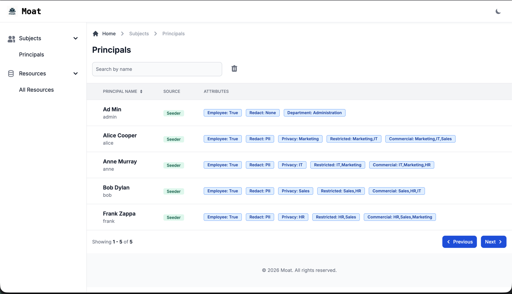
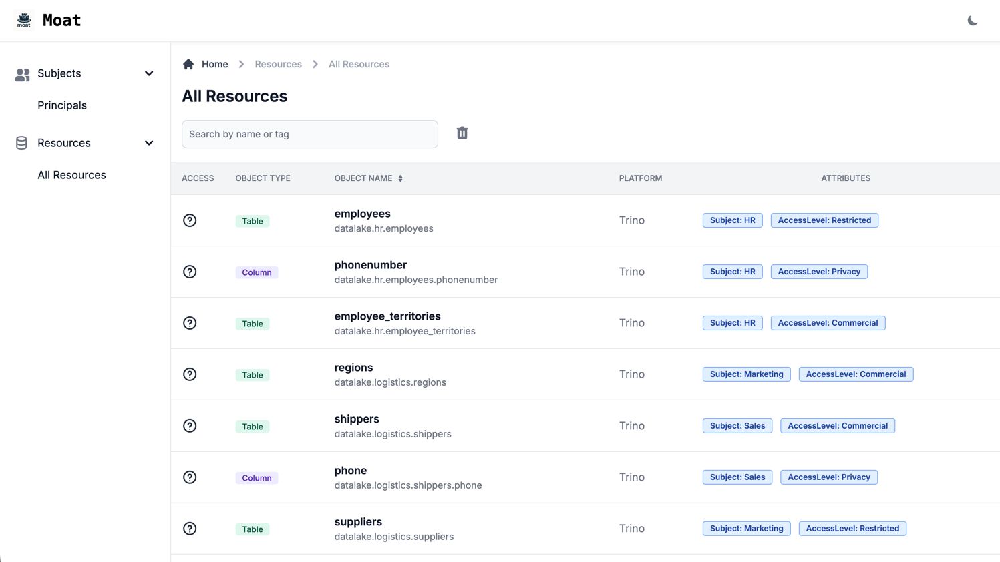

Moat includes a simple read-only user interface. This interface provides visualisation and search functionality for 
both principals and resources known to Moat. 

> As the interface is read-only, no authentication is currently provided for it.
If your use case requires auth, please raise an issue on github for consideration

## Principals View
Searches on the principals view will filter by the `user_name` field

## Resources View
Searches on the resources view will filter by the `fq_name` field

