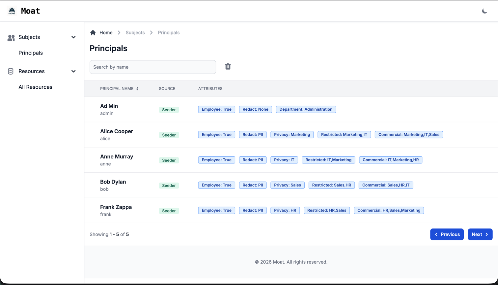
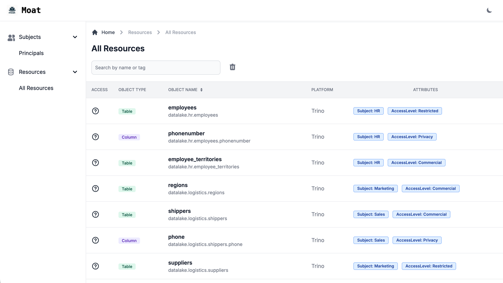
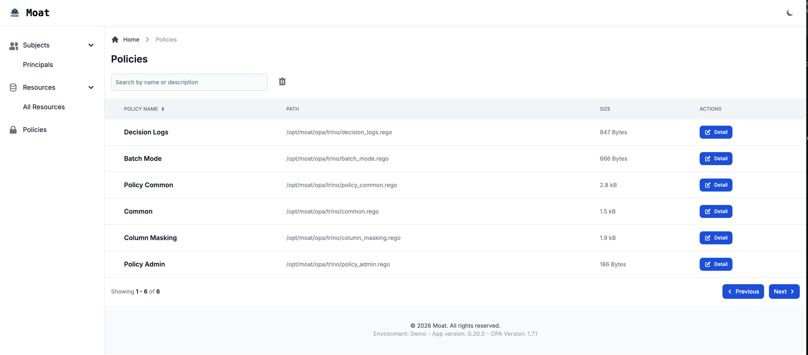
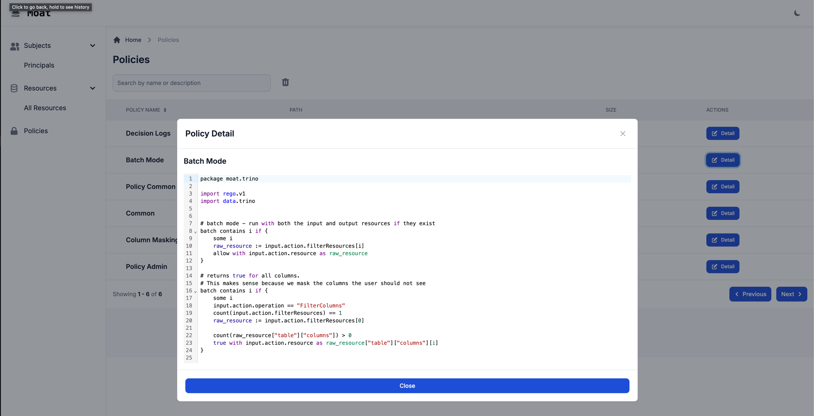

Moat includes a read-only user interface providing visualisation, search, filtering and CSV export for
the principals and resources known to Moat.

> As the interface is read-only, no authentication is currently provided for it.
If your use case requires auth, please raise an issue on github for consideration

## Principals View
The search box matches on `user_name`, `first_name`, `last_name`, `email` and on
attribute keys and values. Several terms can be given, separated by spaces or commas -
a principal must match *every* term to be listed.




## Resources View
The search box matches on `fq_name` and on attribute keys and values.




## Policies View





## Advanced Filtering

Both the principals and resources views carry a **Filters** button next to the search
box. It opens a panel of facets built from the data currently in Moat:

| View | Facets |
| --- | --- |
| Principals | Source, Status (active/inactive), Attribute key/value |
| Resources | Platform, Object type, Status (active/inactive), Attribute key/value |

Filter semantics:

* Values selected within one facet are **OR**'d - ticking two platforms widens the result set.
* Different facets are **AND**'ed - a platform and an object type must both match.
* Attribute filters follow the same rule: two values of the same attribute key widen the
  result set, two different keys narrow it.

Applied filters appear as chips beneath the search box and can be removed individually,
or all at once with **Clear all**. The filter panel, the search box, the column sort and
the pagination controls all post the same query state, so they compose freely.

## CSV Download

The **Download CSV** button exports the current view. The count on the button is the
number of rows the export will contain.

The download carries exactly the filters applied in the UI - search term, facets,
attribute filters and sort order. Pagination is deliberately *not* applied: the CSV
contains every matching row, not just the page on screen.

Because the link is a plain URL, it can also be scripted:

```bash
# every inactive LDAP principal in the finance department
curl -o principals.csv \
  'http://localhost:8000/principals/download?source_type=ldap&active=false&attributes=department:finance'

# every trino table tagged AccessLevel=Commercial
curl -o resources.csv \
  'http://localhost:8000/resources/download?platform=trino&object_type=table&attributes=AccessLevel:Commercial'
```

The `attributes` parameter takes `key:value` and may be repeated. `active` accepts
`any` (the default), `true` or `false`.


## Working with the tables

### URL state

Filters, search term, sort order and page are all reflected in the address bar. A
filtered view can therefore be bookmarked, shared with a colleague, or reopened with
the browser's back button, and a refresh returns exactly the same rows.

Opening such a URL directly serves the full page; navigating to it from inside the app
swaps in just the table. Both paths end up in the same state.

### Keyboard

| Key | Action |
| --- | --- |
| `/` | Focus the search box |
| `Esc` | Clear the search box, then unfocus it |

### Rows per page and density

The table footer carries a rows-per-page selector (10 / 20 / 50 / 100) and a density
toggle that switches between comfortable and compact rows. Density is remembered in
the browser, so it persists across views and sessions; rows per page is part of the
URL state.

### Attribute pills

Attribute pills in the principals and resources tables are clickable - selecting one
applies it as an attribute filter on that view. Clicking a second value of the same
attribute widens the result set; clicking a different attribute narrows it.

### Row detail

The **Detail** button on a row opens a drawer on the right rather than a modal, so the
filtered list stays visible behind it. For a principal the drawer shows its identity,
source, status, attributes and full attribute-change history.

### Loading and empty states

Table requests dim the table and run a progress bar at the top of the page. On first
paint, before any query has returned, skeleton rows are shown rather than a flash of
"no results".

When a table is empty the reason is distinguished: "no X yet" when nothing has been
ingested, versus "no X match these filters" - with a **Clear filters** button - when
the filters excluded everything.
